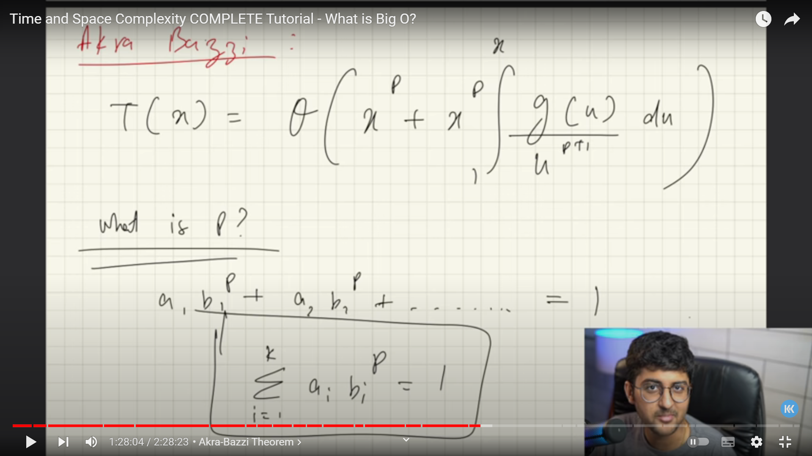
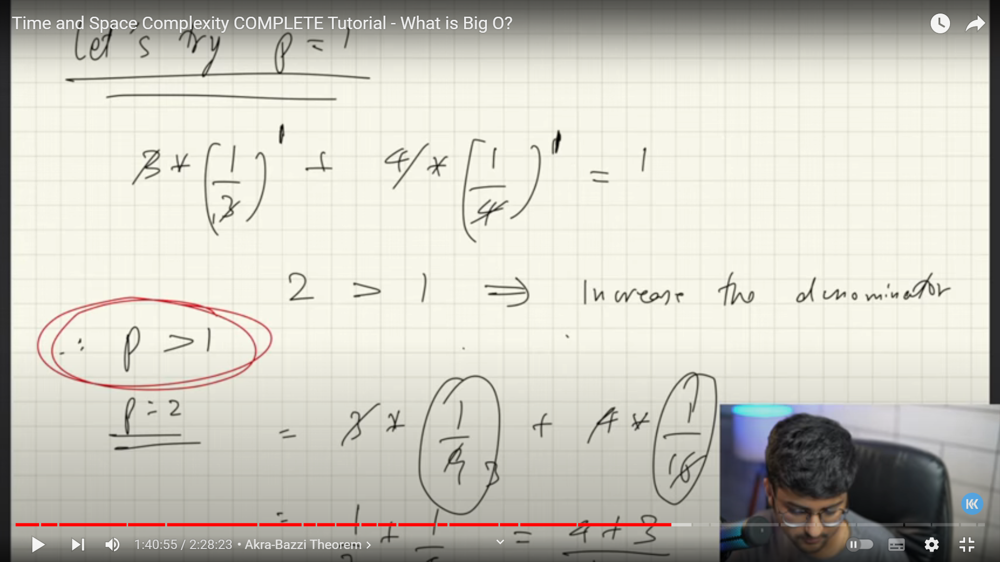
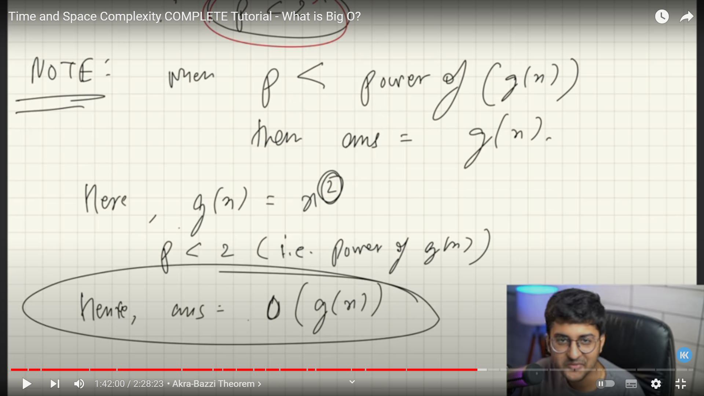
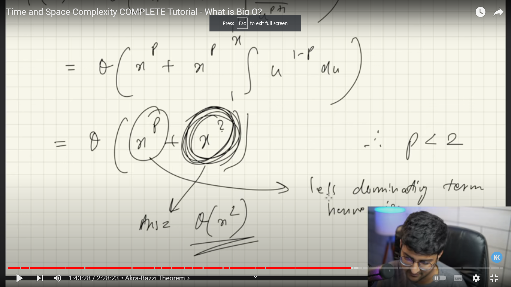

# Time complexity

let's discuss the time complexity according to the 3 questions.

why,what and how.

## Why

why, we even need time complexity , measurement? , why we don't take the time that the machine we are running the algorithm into? the answer for this is taken from the question itself , **The machine** if U 're sure that all the machine 'll take the same time to run your algorithm,then we can do that , bu it's impossible. 
let's consider that example. U run an algorithm in a mac machine with high computing power , and it takes  2s , do  U expect it to take the same time when run it in an old machine runs on windows xp? , surly,not it may take 4s or something like that. lets go to the next section to dive to what's really the time complexity measurement is.

## What

It's rate at which time taken increases with respect to the input size.it's U can call an average way to calculate the algorithm taken time. so we use something named (**Big-Oh**) notation.

## How to compute time complexity

it's ongoing process , applied to every single code or algorithm U generate and it have a se of basic rules.

- consider the worst case scenario -> O(something).
- avoid constants.
- avoid lower values. 

## Space complexity (memory space)

it consists of 2 parts: 

- Auxilary space -> space U take to solve the problem, **in recursive programs the space complexity is the height of the tree,only interlinked function work in the same branch** 
- input space -> space that U take to store the input.

## Recurence 

### Akra-Bazzi

